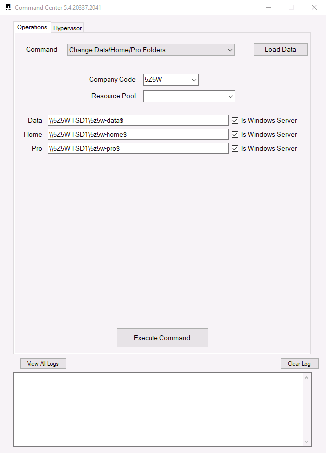

////

Comments Sections:
Used in:

sub.Management.command_center.operations.change_data_home_pro_folders.adoc

////

== *Change Data/Pro/Home Folders* Overview

[.right]

The storage location for the Data, Profiles and Users' Home folders is managed by active directory.  Command Center includes an operation for changing these locations.

//the following image is a narrow, invisible image that acts as a divider to keep image alignment working with the right-aligned image above.  Just don't touch it.
image::Management.command_center.operations.copy_template_to_gallery-ed821.png[width=100%]

== Selecting a Resource pool
When the Resource Pool selection is blank, the settings are applied globally.

Selecting a specific Resource Pool (aka Host pool) will allow for the Users' Profile path to be define individually for that Resource Pool

[.thumb]
image::images/Management.command_center.operations.change_data_home_pro_folders-3ac43.png[][]

== Is Windows Server
The "Is Windows Server" check box should be unchecked if a storage service (e.g. Azure NetApp Files) is selected as the storage location.
