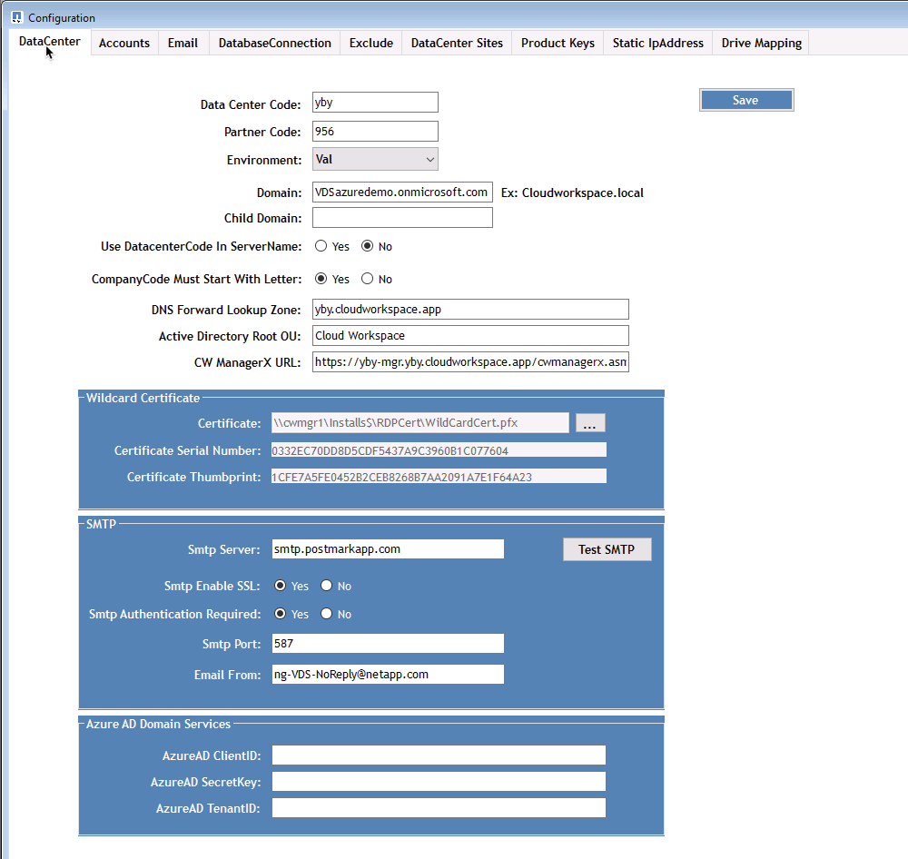
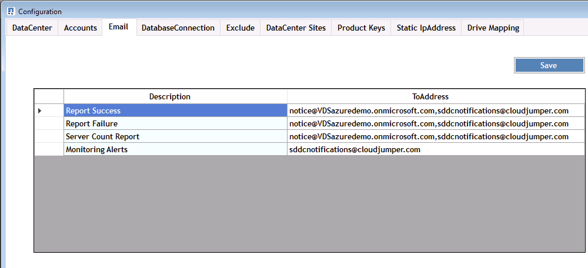
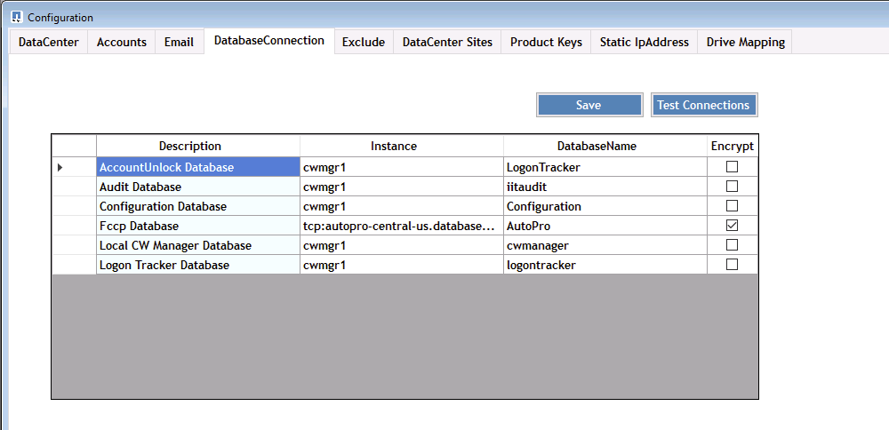
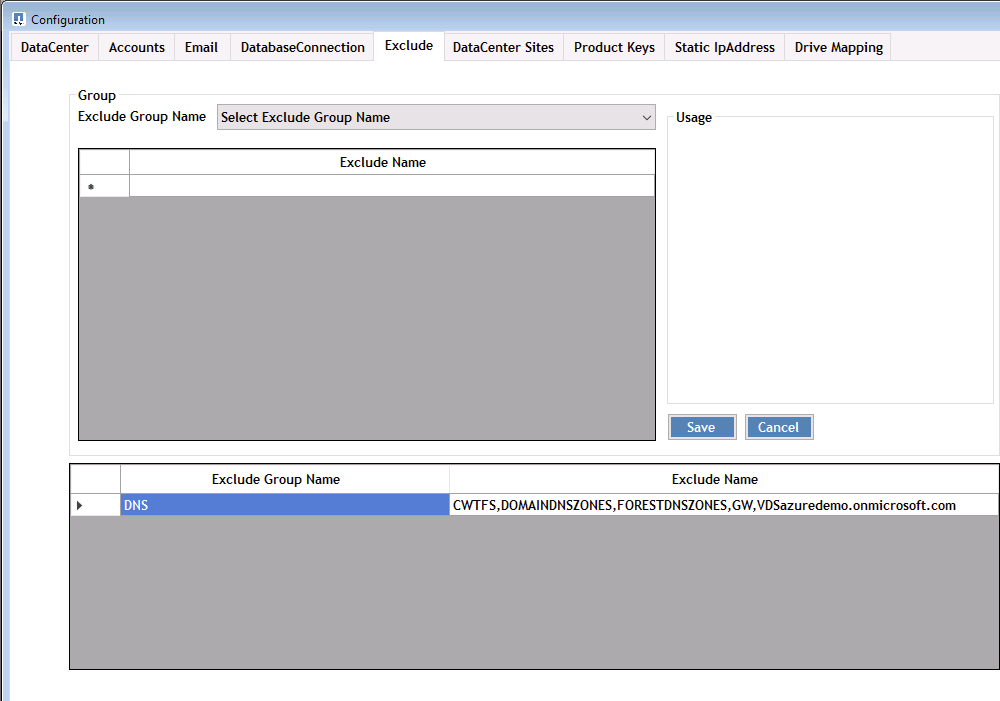
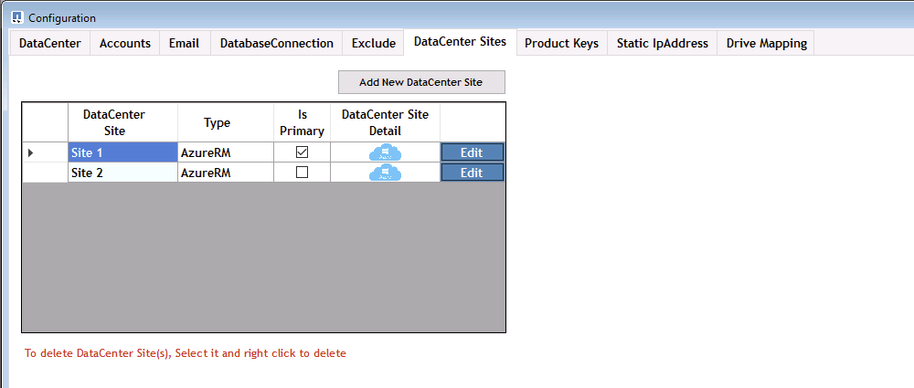
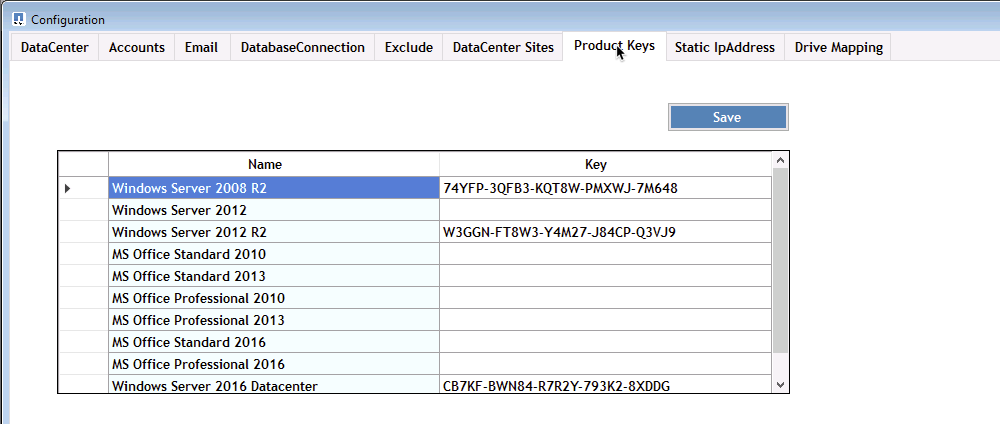
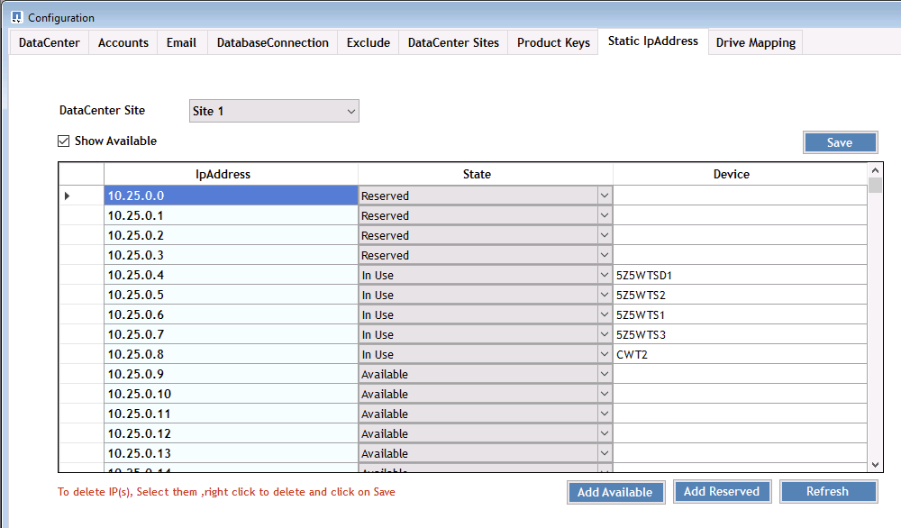
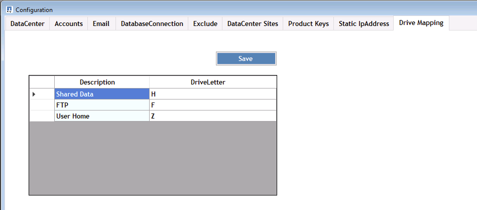
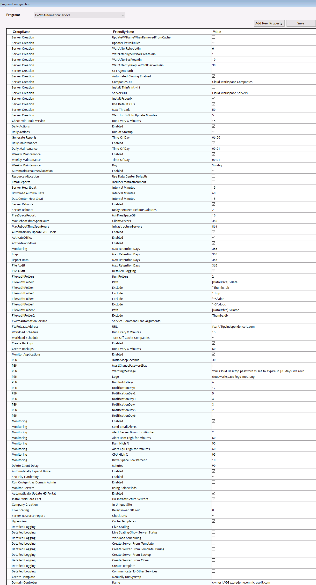

////

Comments Sections:
Used in:

////

== Overview
DCConfig is a configuration utility on the CWMGER1 VM used to set and change many deployment-wide settings.

. Connect to the CWMGER1 VM as an admin
. Run the application from the desktop shortcut

Within the application there are three major sections: Configuration, Advanced and Help.

=== Configurations
The Configurations window opens at launch and has several sub-sections

==== DataCenter

==== Accounts
image::images/Management.dcconfig.dcconfig.overview-f34a2.png[]
==== Email

==== DatabaseConnection

==== Exclude

==== DataCenter Sites

==== Product Keys

==== Static IpAddress

==== Drive Mapping

=== Advanced
The Advanced window displays a list of values that can be edited from within this interface.

[cols=3*,options="header",cols="33,33,33"]
|===
|	GroupName	|	FriendlyName	|	Value
|	GroupName	|	FriendlyName	|	Value
|	Server Creation	|	UpdateVMNameWhenRemovedFromCache	|	True/False
|	Server Creation	|	UpdateFirewallRules	|	True/False
|	Server Creation	|	WaitAfterRebootMin	|	<# minutes>
|	Server Creation	|	WaitAfterHypervisorCreateMin	|	<# minutes>
|	Server Creation	|	WaitAfterSysPrepMin	|	<# minutes>
|	Server Creation	|	WaitAfterSysPrepFor2008ServersMin	|	<# minutes>
|	Server Creation	|	GFI Agent Path	|
|	Server Creation	|	Automated Cloning Enabled	|	True/False
|	Server Creation	|	CompaniesOU	|	<String - Companines OU Name>
|	Server Creation	|	Install ThinPrint v11	|	True/False
|	Server Creation	|	ServersOU	|	<String - Servers OU Name>
|	Server Creation	|	Install FsLogix	|	True/False
|	Server Creation	|	Use Default OUs	|	True/False
|	Server Creation	|	Max Threads	|	<#>
|	Server Creation	|	Wait for DNS to Update Minutes	|	<# minutes>
|	Check Vdc Tools Version	|	Run Every X Minutes	|	<# minutes>
|	Daily Actions	|	Enabled	|	True/False
|	Daily Actions	|	Run at Startup	|	True/False
|	Generate Reports	|	Time Of Day	|	<TIME 00:00>
|	Daily Maintenance	|	Enabled	|	True/False
|	Daily Maintenance	|	Time Of Day	|	<TIME 00:00>
|	Weekly Maintenance	|	Enabled	|	True/False
|	Weekly Maintenance	|	Time Of Day	|	<TIME 00:00>
|	Weekly Maintenance	|	Day	|	<day of the week>
|	AutomaticResourceAllocation	|	Enabled	|	True/False
|	Resource Allocation	|	Use Data Center Defaults	|	True/False
|	EmailReports	|	IncludeEmailAttachment	|	True/False
|	Server Heartbeat	|	Interval Minutes	|	<# minutes>
|	Download AutoPro Data	|	Interval Minutes	|	<# minutes>
|	DataCenter Heartbeat	|	Interval Minutes	|	<# minutes>
|	Server Reboots	|	Enabled	|	True/False
|	Server Reboots	|	Delay Between Reboots Minutes	|	<# minutes>
|	FreeSpaceReport	|	MinFreeSpaceGB	|	<# GB minimum threshold>
|	MaxRebootTimeSpanHours	|	ClientServers	|	<# hours before required reboot>
|	MaxRebootTimeSpanHours	|	InfrastructureServers	|	<# hours before required reboot>
|	Automatically Update vDC Tools	|	Enabled	|	True/False
|	ActivateOffice	|	Enabled	|	True/False
|	ActivateWindows	|	Enabled	|	True/False
|	Monitoring	|	Max Retention Days	|	<# days>
|	Logs	|	Max Retention Days	|	<# days>
|	Report Data	|	Max Retention Days	|	<# days>
|	File Audit	|	Max Retention Days	|	<# days>
|	File Audit	|	Detailed Logging	|	True/False
|	FileAuditFolders	|	NumFolders	|	2
|	FileAuditFolder1	|	Path	|	[DataDrive]:\Data
|	FileAuditFolder1	|	Exclude	|	*Thumbs.db
|	FileAuditFolder1	|	Exclude	|	*.tmp
|	FileAuditFolder1	|	Exclude	|	*~$*.doc
|	FileAuditFolder1	|	Exclude	|	*~$*.docx
|	FileAuditFolder2	|	Path	|	[DataDrive]:\Home
|	FileAuditFolder2	|	Exclude	|	Thumbs.db
|	CwVmAutomationService	|	Service Command Line Arguments	|
|	FtpReleaaeAddress	|	URL	|	<ftp URL>
|	Workload Schedule	|	Run Every X Minutes	|	<# minutes>
|	Workload Schedule	|	Turn Off Cache Companies	|	True/False
|	Create Backups	|	Enabled	|	True/False
|	Create Backups	|	Run Every X Minutes	|	<# minutes>
|	Monitor Applications	|	Enabled	|	True/False
|	PEN	|	InitialSleepSeconds	|	<# seconds>
|	PEN	|	MustChangePasswordDay	|	<# days prior to expire for forced PW reset>
|		|		|	<Password reset text string>
|	PEN	|	Logo	|	<local .png logo path>
|	PEN	|	NumNotifyDays	|	<# days>
|	PEN	|	NotificationDay1	|	<# days prior to expire for notification>
|	PEN	|	NotificationDay2	|	<# days prior to expire for notification>
|	PEN	|	NotificationDay3	|	<# days prior to expire for notification>
|	PEN	|	NotificationDay4	|	<# days prior to expire for notification>
|	PEN	|	NotificationDay5	|	<# days prior to expire for notification>
|	PEN	|	NotificationDay6	|	<# days prior to expire for notification>
|	Monitoring	|	Enabled	|	True/False
|	Monitoring	|	Send Email Alerts	|	True/False
|	Monitoring	|	Alert Server Down for Minutes	|	<# minutes>
|	Monitoring	|	Alert Ram High for Minutes	|	<# minutes>
|	Monitoring	|	Ram High %	|	<RAM % Threshold>
|	Monitoring	|	Alert Cpu High for Minutes	|	<# minutes>
|	Monitoring	|	CPU High %	|	<CPU % Threshold>
|	Monitoring	|	Drive Space Low Percent	|	<Disk Space Free % Threshold>
|	Delete Client Delay	|	Minutes	|	<# minutes>
|	Automatically Expand Drive	|	Enabled	|	True/False
|	Security Hardening	|	Enabled	|	True/False
|	Run CwAgent as Domain Admin	|	Enabled	|	True/False
|	Monitor Servers	|	Using SolarWinds	|	True/False
|	Automatically Update H5 Portal	|	Enabled	|	True/False
|	Install WildCard Cert	|	On Infrastructure Servers	|	True/False
|	Company Creation	|	In Unique Site	|	True/False
|	Live Scaling	|	Delay Power Off Min	|	<# minutes>
|	Server Resource Report	|	Check DNS	|	True/False
|	Hypervisor	|	Cache Templates	|	True/False
|	Detailed Logging	|	Live Scaling	|	True/False
|	Detailed Logging	|	Live Scaling-Show Server Status	|	True/False
|	Detailed Logging	|	Workload Scheduling	|	True/False
|	Detailed Logging	|	Create Server From Template	|	True/False
|	Detailed Logging	|	Create Server From Template Timing	|	True/False
|	Detailed Logging	|	Create Server From Backup	|	True/False
|	Detailed Logging	|	Create Server From Clone	|	True/False
|	Detailed Logging	|	Create Template	|	True/False
|	Detailed Logging	|	Communicate To Other Services	|	True/False
|	Create Template	|	Manually RunSysPrep	|	True/False
|	Domain Controller	|	Name	|	cwmgr1.<domain.com>

|===

=== Help
Opens the local help file.
