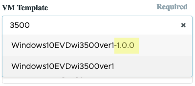

////

Comments Sections:
Used in:

_include/toby-to-do/Management.command_center.copy_template_to_gallery.adoc

////

== Overview

[.right]
[.thumb]
image::Management.command_center.copy_template_to_gallery-67ea4.png[width=350]

When a VDI Provisioning Collection is finalized the image is stored in Azure as an Image and can be deployed within he same VDS Site.  In order to make the image available for deployment in another Azure region within the same Subscription the "Copy Template to Gallery" function is used. This action will copy the VM image to the Shared gallery and replicate it to all the selected regions.

image::images/Management.command_center.copy_template_to_gallery-ed821.png[width=100%]

=== VM Template availability in drop VDS
Once the replication has completed, the image will show in VDS in the dropdown for selecting VM Templates when deploying new VMs.  The shared image will be available for deployment into any region that is selected when copying.

VM Images stored in the Shared Gallery are appended with their version in the form of "-x.x.x" where the version matches the image version within the Azure Portal.

[.thumb]
image::images/Management.command_center.copy_template_to_gallery-04bd8.png[]

[.thumb]

NOTE: The replication fo the image can take a while (depending on the size of the image) and the status can be see by clicking on the version (e.g. #1.0.0#) in the "Name" column as highlighted in the screenshot above.

=== Regional Availability
Deployments can only be performed into the regions where the image has been replicated.  This can be checked in the Azure portal by clicking on the #1.x.x# and then on _Update Replication_ as shown here:

[.thumb]
image::images/Management.command_center.copy_template_to_gallery-9b63a.png[width=75%]
